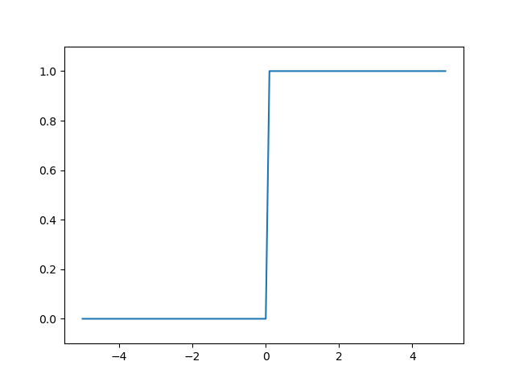

# 신경망

기존의 배웠던 퍼셉트론에서는 가중치를 사람이 직접 입력해 주었다.

하지만 신경망의 중요한 특징은 가중치를 데이터로부터 자동으로 학습한다는 것이다.

# 퍼셉트론에서 신경망으로

신경망은 다음과 같이 **입력층**, **출력층**, **중간층**으로 나뉜다.

중간층에서는 가중치를 계산한 값을 출력 신호로 변환하는 **활성함수**(**activation function**)가 존재한다.

위 그림에서는 앞으로 볼 sigmoid함수가 활성함수로서 작동한다. 

활성함수를 통과한 값들은 다음 **뉴런** 혹은 **노드**로 값이 전달된다.

# 활성함수

## 시그모이드 함수

시그모이드 함수는 S자 곡선을 그리는 함수로 1과 0사이에 특정 값을 출력하는 함수이다.

구현은 [참조](https://github.com/CodeNinja1126/dl_from_scratch/blob/main/3_neural_network/sigmoid.py)

## 계단 함수

계단 함수는 0과 1 두가지 값만을 출력하는 함수이다.

구현은 [참조](https://github.com/CodeNinja1126/dl_from_scratch/blob/main/3_neural_network/step_function.py)

## 시그모이드 함수와 계단 함수 비교

두 함수의 가장 눈에 띄는 차이는 모양의 부드러움 차이이다.

그 외에는 계단 함수의 경우에는 0과 1만을 반환하지만, 시그모이드의 경우에는 그 사이의 값을 반환한다.

또한 시그모이드의 경우에는 입력이 커지면 커질수록 1에 가까운 값을 반환하게 된다.

가장 큰 공통점은 이 두 함수가 비선형 함수라는 사실이다.

활성함수로 선형함수를 사용하면 층을 쌓아도 결국 결과적으로 선형함수가 되므로,

층을 쌓는 이점을 얻을 수 없다.

따라서 우리는 반드시 활성 함수로 비선형 함수를 사용해야 한다.

## ReLU 함수

최근 신경망 네트워크에서 많이 사용되는 활성함수이다.

입력이 0보다 클 경우 입력을 반환하고, 입력이 0보다 같거나 클 경우 0을 반환한다.

구현은 [참조](https://github.com/CodeNinja1126/dl_from_scratch/blob/main/3_neural_network/ReLU.py)

# 3층 신경망 구현하기
numpy배열을 이용하면 신경망을 적은 코드로도 구현할 수 있다.

구현은 [참조](https://github.com/CodeNinja1126/dl_from_scratch/blob/main/3_neural_network/neural_network.py)

# 출력층

## 항등함수와 소프트맥스 함수
항등함수는 계산된 값을 그대로 출력한다.

반면에 소프트맥스 함수는 다음과 같다.

